# python_labs

## Лабораторная работа 1

### 1 задание

```python
name = input("Имя: ")
age = int(input("Возраст: "))

print(f"Привет, {name}! Через год тебе будет {age + 1}.")
```

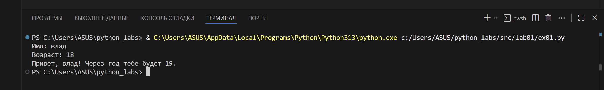

### 2 задание

```python
a = float(input("Enter first number: ").replace(",", "."))
b = float(input("Enter second number: ").replace(",", "."))

s = a + b
avg = s / 2

print(f"sum={s:.2f}; avg={avg:.2f}")
```

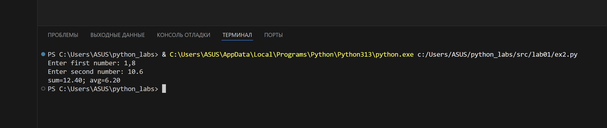

### 3 задание

```python

price = float(input("Цена: "))
discount = float(input("Скидка (%): "))
vat = float(input("НДС (%): "))

base = price * (1 - discount / 100)
vat_amount = base * (vat / 100)
total = base + vat_amount

print(f"База после скидки: {base:.2f} ₽")
print(f"НДС: {vat_amount:.2f} ₽")
print(f"Итого к оплате: {total:.2f} ₽")
```

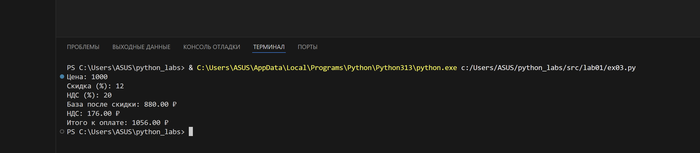

### 4 задание

```python

min = int(input("Минуты: "))

hours = min // 60
minutes = min % 60

print(f"{hours}:{minutes:02d}")
```

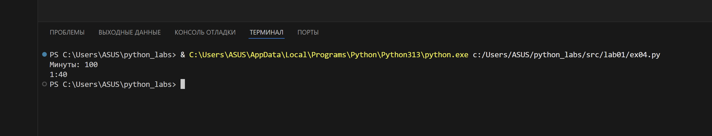

### 5 задание

``` python
fio = input("ФИО: ")
fio_clean = " ".join(fio.split())
initials = "".join([word[0].upper() for word in fio_clean.split()]) + "."
length = len(fio_clean)

print(f"Инициалы: {initials}")
print(f"Длина (символов): {length}")
```

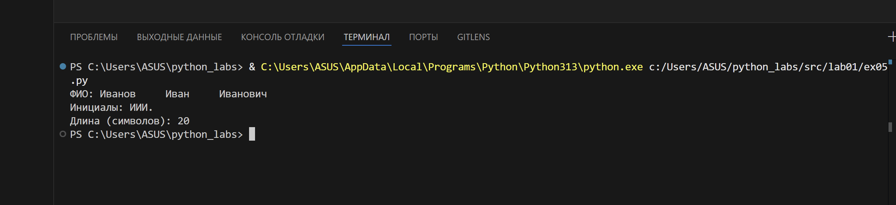

## Лабораторная работа 2

### задание 1

``` python
def min_max(nums: list[float | int]):
  if not nums:
    raise ValueError("Список не может быть пустым")
  return (min(nums), max(nums))

def unique_sorted(nums: list[float | int]):
  return sorted(list(set(nums)))

def flatten(mat: list[list | tuple]):
  result = []
  for row in mat:
    if not isinstance(row, (list, tuple)):
      raise TypeError("Все элементы должны быть списками или кортежами")
    for item in row:
      result.append(item)
  return result

print(min_max([3, -1, 5, 5, 0]))
print(min_max([42]))
print(min_max([-5, -2, -9]))
print(min_max([1.5, 2, 2.0, -3.1]))
print(min_max([]))


print(unique_sorted([3, 1, 2, 1, 3]))
print(unique_sorted([]))
print(unique_sorted([-1, -1, 0, 2, 2 ]))
print(unique_sorted([1.0, 1, 2.5, 2.5, 0]))

print(flatten([[1, 2,], [3, 4]]))
print(flatten([[1, 2], (3, 4, 5)]))
print(flatten([[1], [], [2, 3]]))
print(flatten([[1, 2], "ab"]))
```

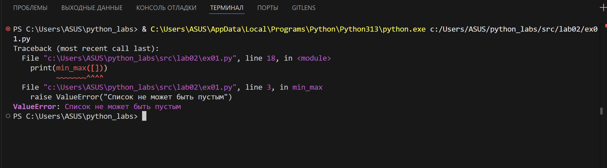

### задание 2

```python
def is_rect(mat: list[list[float | int]]) -> bool:
    return all(len(row) == len(mat[0]) for row in mat) if mat else True

def transpose(mat: list[list[float | int]]):
    if not mat:
        return []
    if not is_rect(mat):
        raise ValueError("Матрица должна быть прямоугольной")
    return [[row[j] for row in mat] for j in range(len(mat[0]))]


print(transpose([[1, 2, 3]]))
print(transpose([[1, 2], [3, 4]]))
print(transpose([]))
print(transpose([[1, 2], [3]]))


```

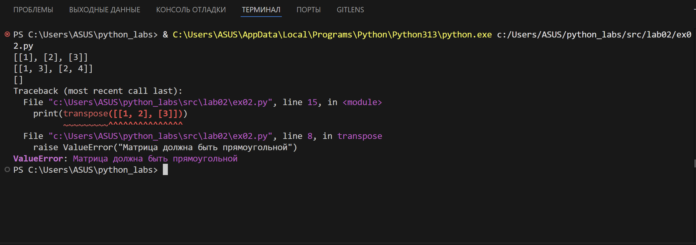

### задание 3

``` python
def format_record(rec: tuple[str, str, float]):
    fio = rec[0]
    group = rec[1]
    gpa = rec[2]
    
    if not isinstance(fio, str) or not fio.strip():
        raise ValueError("ФИО должно быть не пустой строкой.")
    if not isinstance(group, str) or not group.strip():
        raise ValueError("Группа должна быть не пустой строкой.")
    if not isinstance(gpa, (int, float)):
        raise ValueError("GPA должно быть числом.")
    
    name_parts = fio.split()    
    surname = name_parts[0]
    initials = "".join([part[0].upper() + "." for part in name_parts[1:]])

    return f"{surname} {initials}, гр. {group}, GPA {gpa:.2f}"

print(format_record(("Иванов Иван Иванович", "BIVT-25", 4.6)))
print(format_record(("Петров Пётр", "IKBO-12", 5.0)))
print(format_record(("Петров Пётр Петрович", "IKBO-12", 5.0)))
print(format_record(("Петров Пётр Петрович", "IKBO-12", 5.0)))
print(format_record(( 3013013 , "ABB-01", 3.999)))
```

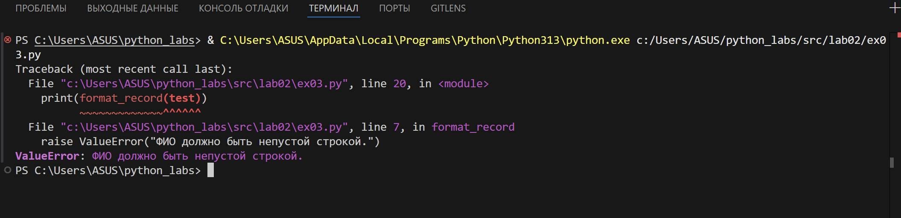

## ЛАБОРАТОРНАЯ РАБОТА 4

## Код программы

- [io_txt_csv.py](src/lab04/io_txt_csv.py) - модуль для работы с файлами
- [text_report.py](src/lab04/text_report.py) - скрипт генерации отчетов

### тест кейс

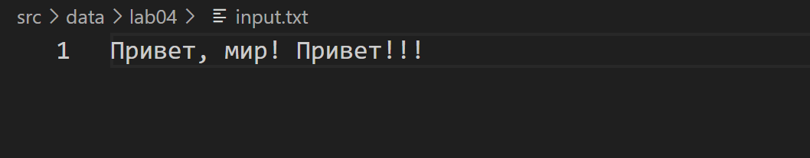

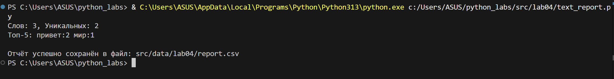

## ЛАБОРАТОРНАЯ РАБОТА 5

### Цель работы

Разобраться с форматами JSON, CSV и XLSX. Реализовать конвертацию между форматами.

### Код программы

- [json_csv.py](src/lab05/json_csv.py) - модуль для конвертации JSON↔CSV
- [csv_xlsx.py](src/lab05/csv_xlsx.py) - модуль для конвертации CSV→XLSX

### Использование

```python
from src.lab05.json_csv import json_to_csv, csv_to_json
from src.lab05.csv_xlsx import csv_to_xlsx

# JSON -> CSV
json_to_csv('src/data/lab05/samples/people.json', 'src/data/lab05/out/people_from_json.csv')

# CSV -> JSON
csv_to_json('src/data/lab05/samples/people.csv', 'src/data/lab05/out/people_from_csv.json')

# CSV -> XLSX
csv_to_xlsx('src/data/lab05/out/people_from_json.csv', 'src/data/lab05/out/people_from_json.xlsx')
```

### Проверка конвертаций

#### Сценарий 1: JSON → CSV

- Входной файл: `src/data/lab05/samples/people.json`
- Результат: `src/data/lab05/out/people_from_json.csv`
- Заголовки упорядочены по алфавиту
- Отсутствующие поля заполняются пустыми строками

#### Сценарий 2: CSV → JSON

- Входной файл: `src/data/lab05/samples/people.csv`
- Результат: `src/data/lab05/out/people_from_csv.json`
- Все значения сохраняются как строки
- Формат вывода: `ensure_ascii=False, indent=2`

#### Сценарий 3: CSV → XLSX

- Входной файл: `src/data/lab05/samples/cities.csv`
- Результат: `src/data/lab05/out/cities.xlsx`
- Автоматический подбор ширины колонок (минимум 8 символов)
- Лист называется "Sheet1"

### Результаты выполнения

## Результаты выполнения

### Входные данные

#### people.csv

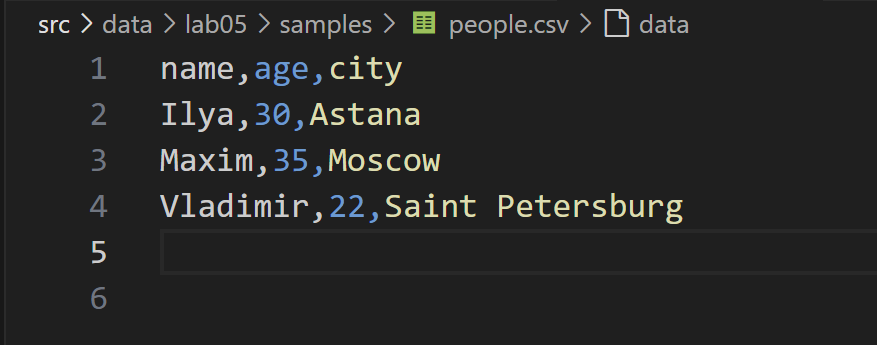

#### people.json

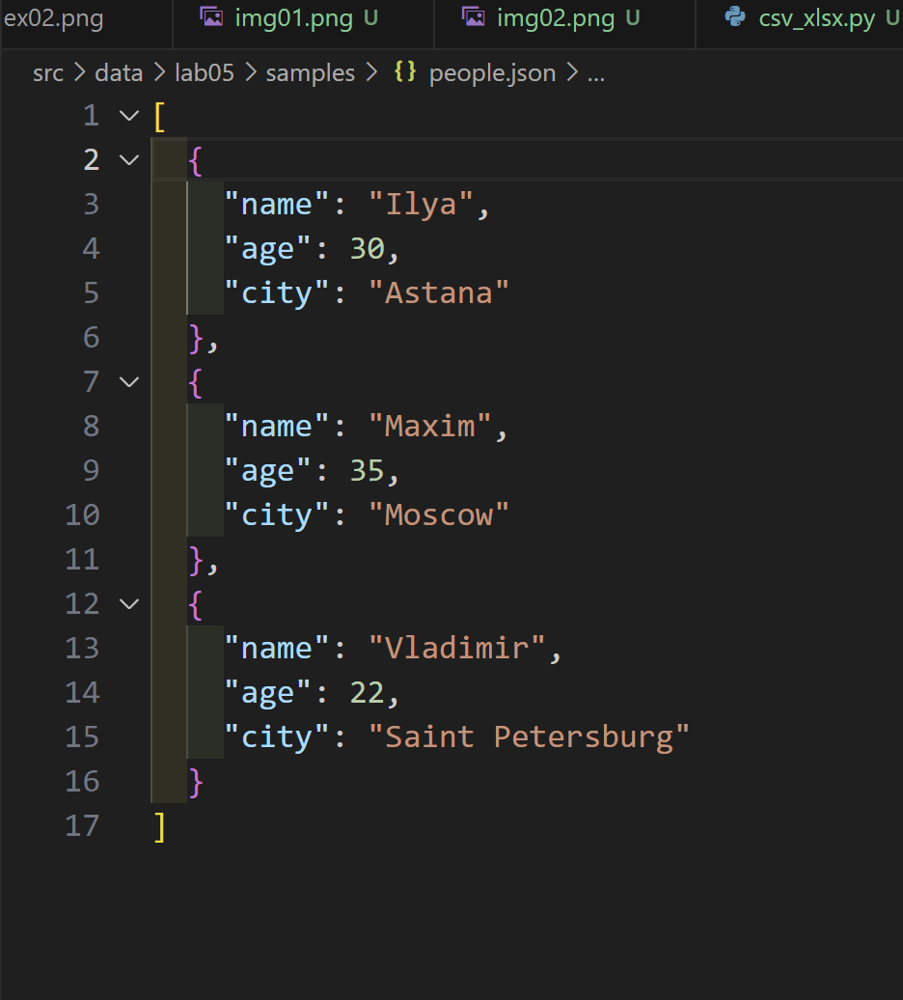

#### cities.csv

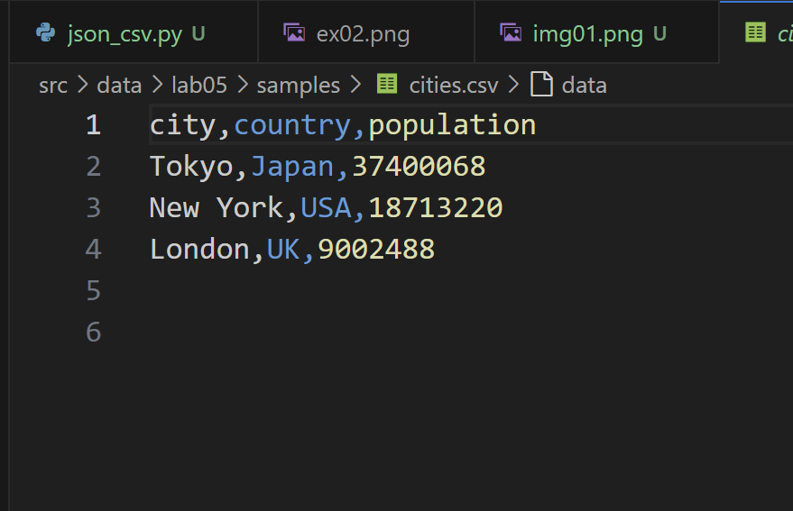

### Выходные файлы

#### people_from_json.csv

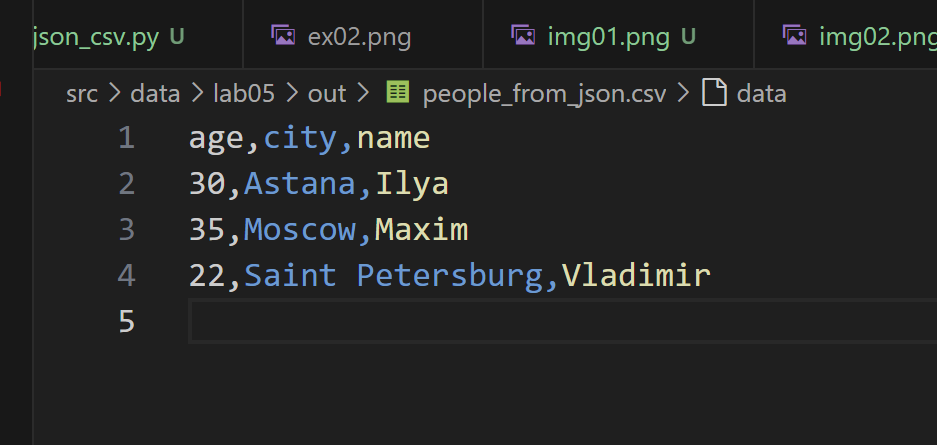

#### cities_from_csv.xlsx

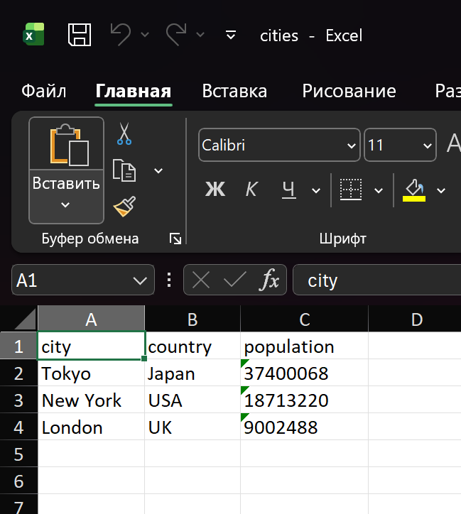

people_from_json.xlsx
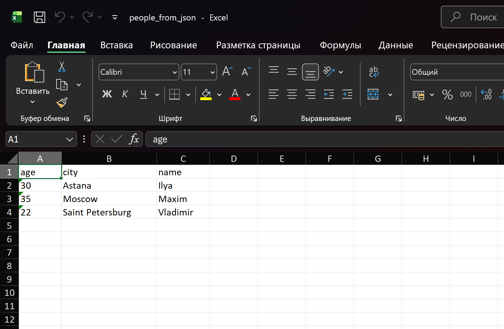

### Обработка ошибок

- Несуществующий файл → `FileNotFoundError`
- Пустой файл → `ValueError`
- Некорректный формат JSON → `ValueError`
- CSV без заголовка → `ValueError`

### Зависимости

Установка зависимостей:

```bash
pip install -r requirements.txt
```

Требуется только `openpyxl`. Остальное - стандартная библиотека Python.
