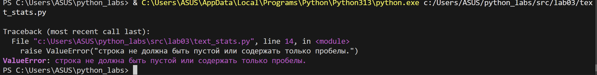
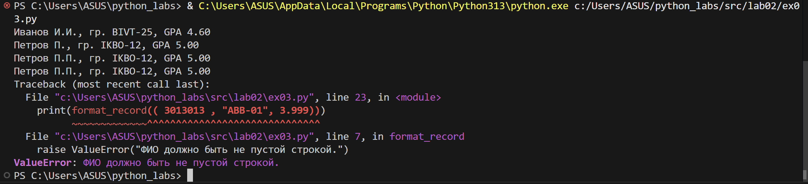

# python_labs

Лабораторные работы по Python

---

## ЛАБОРАТОРНАЯ РАБОТА 6

### Цель работы

Научиться создавать консольные инструменты с аргументами командной строки, подкомандами и флагами с использованием модуля `argparse`.

### Код программы

- [cli_text.py](src/lab06/cli_text.py) - CLI-утилиты для работы с текстом (cat и stats)
- [cli_convert.py](src/lab06/cli_convert.py) - CLI-утилиты для конвертации данных (JSON, CSV, XLSX)

### Команды cli_text.py

#### Команда `cat`

Выводит содержимое файла построчно с опциональной нумерацией строк.

**Использование:**

```bash
python -m src.lab06.cli_text cat --input <путь_к_файлу> [-n]
```

**Параметры:**

- `--input` (обязательный) - путь к входному файлу
- `-n` (опциональный) - нумеровать строки

**Примеры:**

```bash
# Вывод содержимого файла
python -m src.lab06.cli_text cat --input src/data/lab04/input.txt

# Вывод с нумерацией строк
python -m src.lab06.cli_text cat --input src/data/lab04/input.txt -n

# Вывод CSV файла с нумерацией
python -m src.lab06.cli_text cat --input src/data/lab05/samples/people.csv -n
```

#### Команда `stats`

Анализирует частоты слов в текстовом файле и выводит статистику.

**Использование:**

```bash
python -m src.lab06.cli_text stats --input <путь_к_файлу> [--top N]
```

**Параметры:**

- `--input` (обязательный) - путь к текстовому файлу
- `--top` (опциональный) - количество топ-слов для вывода (по умолчанию: 5)

**Примеры:**

```bash
# Анализ текста с топ-5 словами
python -m src.lab06.cli_text cat --input src/data/lab06/samples/people.txt -n

# Анализ с топ-5 словами
python -m src.lab06.cli_text stats --input src/data/lab06/samples/people.txt --top 5
```

**Вывод команды stats:**

```
Всего слов: X
Уникальных слов: Y
Топ-5:
  слово1: частота1
  слово2: частота2
  ...
```

### Команды cli_convert.py

#### Команда `json2csv`

Конвертирует JSON-файл (список словарей) в CSV-файл.

**Использование:**
```bash
python -m src.lab06.cli_convert json2csv --in <входной.json> --out <выходной.csv>
```

**Пример:**
```bash
python -m src.lab06.cli_convert json2csv --in src/data/lab06/samples/people.json --out src/data/lab06/out/people.csv
```

#### Команда `csv2json`

Конвертирует CSV-файл в JSON-файл (список словарей).

**Использование:**
```bash
python -m src.lab06.cli_convert csv2json --in <входной.csv> --out <выходной.json>
```

**Пример:**
```bash
python -m src.lab06.cli_convert csv2json --in src/data/lab06/samples/people.csv --out src/data/lab06/out/people.json
```

#### Команда `csv2xlsx`

Конвертирует CSV-файл в XLSX-файл.

**Использование:**
```bash
python -m src.lab06.cli_convert csv2xlsx --in <входной.csv> --out <выходной.xlsx>
```

**Пример:**
```bash
python -m src.lab06.cli_convert csv2xlsx --in src/data/lab06/samples/people.csv --out src/data/lab06/out/people.xlsx
```

### Справка по командам

Для получения справки по любой команде используйте флаг `--help`:

```bash
# Справка по cli_text
python -m src.lab06.cli_text --help
python -m src.lab06.cli_text cat --help
python -m src.lab06.cli_text stats --help

# Справка по cli_convert
python -m src.lab06.cli_convert --help
python -m src.lab06.cli_convert json2csv --help
python -m src.lab06.cli_convert csv2json --help
python -m src.lab06.cli_convert csv2xlsx --help
```

### Обработка ошибок

- Несуществующий файл → `FileNotFoundError` с понятным сообщением
- Неверные аргументы → вывод справки и сообщение об ошибке
- Ошибки чтения файлов → обработка `UnicodeDecodeError`
- Пустой файл при анализе → корректное сообщение пользователю
- Неверные параметры (например, отрицательный `--top`) → `ValueError`

### Зависимости

- **Только стандартная библиотека Python** (`argparse`, `pathlib`, `sys`, `os`)
- Использует функции из предыдущих лабораторных:
  - `lib/text.py` - для анализа текста (нормализация, токенизация, подсчет частот)
  - `lab05/json_csv.py` - для конвертации JSON ↔ CSV
  - `lab05/csv_xlsx.py` - для конвертации CSV → XLSX

### Демонстрация работы

Скриншоты работы команд находятся в папке [images/lab06/](images/lab06/).

---

## ЛАБОРАТОРНАЯ РАБОТА 5

### Цель работы

Разобраться с форматами JSON, CSV и XLSX. Реализовать конвертацию между форматами.

### Код программы

- [json_csv.py](src/lab05/json_csv.py) - модуль для конвертации JSON↔CSV
- [csv_xlsx.py](src/lab05/csv_xlsx.py) - модуль для конвертации CSV→XLSX

### Входные данные


### Выходные файлы


### Обработка ошибок

- Несуществующий файл → `FileNotFoundError`
- Неверное расширение файла (.txt вместо .json) → `ValueError`
- Пустой файл → `ValueError`
- Некорректный формат JSON → `ValueError`
- CSV без заголовка → `ValueError`

### Зависимости

Установка дополнительной библиотеки:

```bash
pip install -r requirements.txt
```

Требуется только `openpyxl`. Остальное - стандартная библиотека Python.

---

## ЛАБОРАТОРНАЯ РАБОТА 4

### Цель работы

Обработка текстовых файлов, работа с CSV, генерация отчетов.

### Код программы

- [io_txt_csv.py](src/lab04/io_txt_csv.py) - модуль для работы с файлами
- [text_report.py](src/lab04/text_report.py) - скрипт генерации отчетов

### Результаты выполнения


---

## ЛАБОРАТОРНАЯ РАБОТА 3

### Цель работы

Работа с текстовыми данными: нормализация, токенизация, подсчет частоты слов.

### Код программы

- [text_stats.py](src/lab03/text_stats.py) - модуль для статистики текста

### Задание А

```python
def normalize(text: str, *, casefold: bool = True, yo2e: bool = True) -> str:
    if text is None:
        raise ValueError("Ошибка: текст не может быть None")
    if not isinstance(text, str):
        raise TypeError(f"Ошибка: ожидалась строка, получен {type(text).__name__}")
    if len(text) == 0:
        return ""
    if yo2e:
        text = text.replace('ё', 'е').replace('Ё', 'Е')
    if casefold:
        text = text.casefold()
    return ' '.join(text.split())

def tokenize(text: str) -> list[str]:
    import re
    return re.findall(r"\w+(?:-\w+)*", text)

def count_freq_manual(tokens: list[str]) -> dict[str, int]:
    if not tokens:
        return {}
    freq_dict = {}
    for token in tokens:
        freq_dict[token] = freq_dict.get(token, 0) + 1
    return freq_dict

def top_n(freq: dict[str, int], n: int = 5) -> list[tuple[str, int]]:
    sorted_items = sorted(freq.items(), key=lambda item: (-item[1], item[0]))
    return sorted_items[:n]
```


### Задание В

Анализ текста с выводом статистики


Проверка обработки ошибок:



---

## ЛАБОРАТОРНАЯ РАБОТА 2

### Цель работы

Работа с функциями, списками, матрицами.

### Задание 1

Работа с числами: min/max, уникальные значения, развертывание матриц.

```python
def min_max(nums: list[float | int]):
  if not nums:
    raise ValueError("Список не может быть пустым")
  return (min(nums), max(nums))

def unique_sorted(nums: list[float | int]):
  return sorted(list(set(nums)))

def flatten(mat: list[list | tuple]):
  result = []
  for row in mat:
    if not isinstance(row, (list, tuple)):
      raise TypeError("Все элементы должны быть списками или кортежами")
    for item in row:
      result.append(item)
  return result

print(min_max([3, -1, 5, 5, 0]))
print(min_max([42]))
print(min_max([-5, -2, -9]))
print(min_max([1.5, 2, 2.0, -3.1]))
print(min_max([]))

print(unique_sorted([3, 1, 2, 1, 3]))
print(unique_sorted([]))
print(unique_sorted([-1, -1, 0, 2, 2 ]))
print(unique_sorted([1.0, 1, 2.5, 2.5, 0]))

print(flatten([[1, 2,], [3, 4]]))
print(flatten([[1, 2], (3, 4, 5)]))
print(flatten([[1], [], [2, 3]]))
print(flatten([[1, 2], "ab"]))
```


### Задание 2

Транспонирование матриц

```python
def is_rect(mat: list[list[float | int]]) -> bool:
    return all(len(row) == len(mat[0]) for row in mat) if mat else True

def transpose(mat: list[list[float | int]]):
    if not mat:
        return []
    if not is_rect(mat):
        raise ValueError("Матрица должна быть прямоугольной")
    return [[row[j] for row in mat] for j in range(len(mat[0]))]

print(transpose([[1, 2, 3]]))
print(transpose([[1, 2], [3, 4]]))
print(transpose([]))
print(transpose([[1, 2], [3]]))
```


### Задание 3

Форматирование записей студентов

```python
def format_record(rec: tuple[str, str, float]):
    fio = rec[0]
    group = rec[1]
    gpa = rec[2]
    
    if not isinstance(fio, str) or not fio.strip():
        raise ValueError("ФИО должно быть не пустой строкой.")
    if not isinstance(group, str) or not group.strip():
        raise ValueError("Группа должна быть не пустой строкой.")
    if not isinstance(gpa, (int, float)):
        raise ValueError("GPA должно быть числом.")
    
    name_parts = fio.split()    
    surname = name_parts[0]
    initials = "".join([part[0].upper() + "." for part in name_parts[1:]])

    return f"{surname} {initials}, гр. {group}, GPA {gpa:.2f}"

print(format_record(("Иванов Иван Иванович", "BIVT-25", 4.6)))
print(format_record(("Петров Пётр", "IKBO-12", 5.0)))
print(format_record(("Петров Пётр Петрович", "IKBO-12", 5.0)))
print(format_record(( 3013013 , "ABB-01", 3.999)))
```



---

## ЛАБОРАТОРНАЯ РАБОТА 1

### Цель работы

Основы Python: ввод-вывод, арифметические операции, работа со строками.

### Задание 1

Ввод имени и возраста

```python
name = input("Имя: ")
age = int(input("Возраст: "))

print(f"Привет, {name}! Через год тебе будет {age + 1}.")
```


### Задание 2

Сумма и среднее арифметическое

```python
a = float(input("Enter first number: ").replace(",", "."))
b = float(input("Enter second number: ").replace(",", "."))

s = a + b
avg = s / 2

print(f"sum={s:.2f}; avg={avg:.2f}")
```


### Задание 3

Расчет цены с учетом скидки и НДС

```python
price = float(input("Цена: "))
discount = float(input("Скидка (%): "))
vat = float(input("НДС (%): "))

base = price * (1 - discount / 100)
vat_amount = base * (vat / 100)
total = base + vat_amount

print(f"База после скидки: {base:.2f} ₽")
print(f"НДС: {vat_amount:.2f} ₽")
print(f"Итого к оплате: {total:.2f} ₽")
```


### Задание 4

Преобразование минут в формат часы:минуты

```python
min = int(input("Минуты: "))

hours = min // 60
minutes = min % 60

print(f"{hours}:{minutes:02d}")
```


### Задание 5

Работа с ФИО: извлечение инициалов и подсчет длины

```python
fio = input("ФИО: ")
fio_clean = " ".join(fio.split())
initials = "".join([word[0].upper() for word in fio_clean.split()]) + "."
length = len(fio_clean)

print(f"Инициалы: {initials}")
print(f"Длина (символов): {length}")
```


