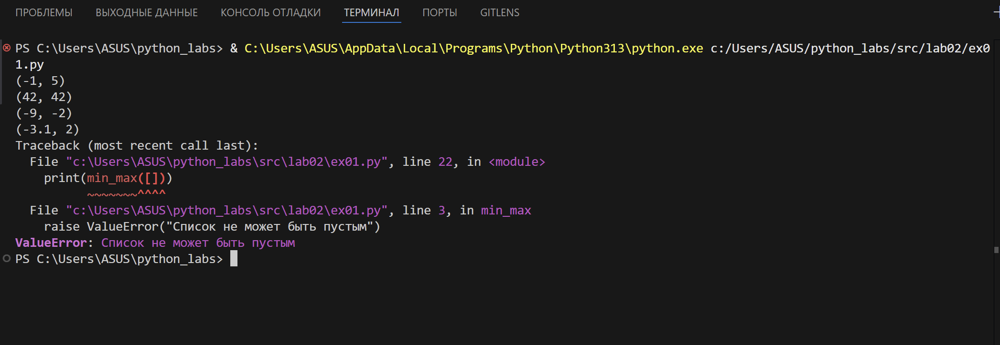

# python_labs

## Лабораторная работа 1

### 1 задание

```python
name = input("Имя: ")
age = int(input("Возраст: "))

print(f"Привет, {name}! Через год тебе будет {age + 1}.")
```


### 2 задание

```python
a = float(input("Enter first number: ").replace(",", "."))
b = float(input("Enter second number: ").replace(",", "."))

s = a + b
avg = s / 2

print(f"sum={s:.2f}; avg={avg:.2f}")
```


### 3 задание

```python

price = float(input("Цена: "))
discount = float(input("Скидка (%): "))
vat = float(input("НДС (%): "))

base = price * (1 - discount / 100)
vat_amount = base * (vat / 100)
total = base + vat_amount

print(f"База после скидки: {base:.2f} ₽")
print(f"НДС: {vat_amount:.2f} ₽")
print(f"Итого к оплате: {total:.2f} ₽")
```


### 4 задание

```python

min = int(input("Минуты: "))

hours = min // 60
minutes = min % 60

print(f"{hours}:{minutes:02d}")
```


### 5 задание

``` python
fio = input("ФИО: ")
fio_clean = " ".join(fio.split())
initials = "".join([word[0].upper() for word in fio_clean.split()]) + "."
length = len(fio_clean)

print(f"Инициалы: {initials}")
print(f"Длина (символов): {length}")
```


## Лабораторная работа 2

### задание 1

``` python
def min_max(nums: list[float | int]):
  if not nums:
    raise ValueError("Список не может быть пустым")
  return (min(nums), max(nums))

def unique_sorted(nums: list[float | int]):
  return sorted(list(set(nums)))

def flatten(mat: list[list | tuple]):
  result = []
  for row in mat:
    if not isinstance(row, (list, tuple)):
      raise TypeError("Все элементы должны быть списками или кортежами")
    for item in row:
      result.append(item)
  return result

print(min_max([3, -1, 5, 5, 0]))
try:
    min_max([])  # ValueError
except ValueError as error:
    print(f"Ошибка в min_max: {error}")

print(unique_sorted([3, 1, 2, 1, 3]))

print(flatten([[1, 2], [3, 4]]))

try:
    flatten([[1, 2], "не список"])  # TypeError
except TypeError as error:
    print(f"Ошибка в flatten: {error}")
```



### задание 2

```python
def is_rect(mat: list[list[float | int]]) -> bool:
    return all(len(row) == len(mat[0]) for row in mat) if mat else True

def transpose(mat: list[list[float | int]]):
    if not mat:
        return []
    if not is_rect(mat):
        raise ValueError("Матрица должна быть прямоугольной")

    
    return [[row[j] for row in mat] for j in range(len(mat[0]))]


try:
    print(transpose([[1, 2], [3, 4, 5]]))
except ValueError as error:
    print(f"Ошибка: {error}")
    
    
print(transpose([[1, 2, 3]]))
print(transpose([[1, 2], [3, 4], [5, 6]]))

```


### задание 3

``` python
def format_record(rec: tuple[str, str, float]):
    fio = rec[0]
    group = rec[1]
    gpa = rec[2]
    
    name_parts = fio.strip().split()
    
    surname = name_parts[0]
    initials = "".join([part[0].upper() + "." for part in name_parts[1:]])

    return f"{surname} {initials}, гр. {group}, GPA {gpa:.2f}"

test = ("Иванов Иван Иванович", "BIVT-25", 4.6)
print(format_record(test))
```


